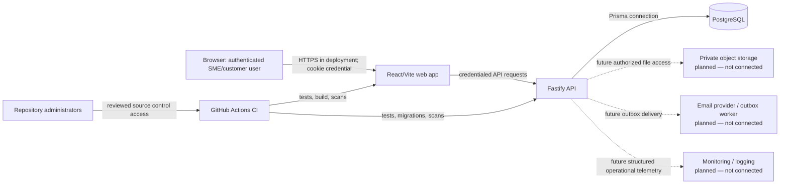

# M00 baseline and security evidence

**Recorded:** 2026-08-26
**Repositories:** `InegoM/trustpay-api`, `InegoM/trustpay-web`
**Scope:** reproducible baseline and executable smoke-test preparation only. No M01+ product capability is introduced here.

## Architecture and trust boundaries

Trust boundaries are browser-to-web, web-to-API, API-to-database, CI-to-repositories, and administrator-to-source-control. The API derives the user and organization memberships from the server-side session and uses server-side repository authorization; client-side controls are not authorization. UUIDs and slugs are identifiers, not authority. Files, email delivery, and monitoring are deliberately labelled as disconnected future boundaries rather than presented as functioning services.

## Environment and data inventory

| Environment | Data | Database | External effects |
| --- | --- | --- | --- |
| Development | Synthetic `.test` identities only | `trustpay` on local port 55432 | No email, storage, payment, or production integration |
| Automated test | Synthetic `.test` identities only | `trustpay_test` on local port 55433 or CI service | No email, storage, payment, or production integration |
| Staging | Not provisioned | Not provisioned | Must be separate before M10 |
| Production | Not provisioned | Not provisioned | Must be separately configured and reviewed before M10 |

Development and automated tests must never use real customer data. The seed's identifiable-looking names, organizations, invitation, and password are explicitly local synthetic fixtures; they must not be used outside local development/test environments.

## Control register

Owner for this baseline is **InegoM, repository owner**. Before pilot release, M10 must name an operational security owner and backup decision-maker. Review all critical and high risks before every pilot release and after any security, privacy, availability, or customer-dispute incident.

| ID | Status | Evidence | Review date | Remaining limitation |
| --- | --- | --- | --- | --- |
| GOV-001 | Implemented for M00 | This register records owner, status, evidence, and review date. | 2026-08-26 | Must be maintained through M10/M11 and release reviews. |
| GOV-002 | Implemented for M00 | Architecture/trust-boundary diagram above includes browser, API, database, future files/email/monitoring, CI, and administrators. | 2026-08-26 | Provider-specific data flows await M03/M05/M10. |
| IAM-001 | Implemented for M00 | `src/auth/password.ts` uses salted Node scrypt with explicit work factors; `password.test.ts` and `security:password-benchmark` verify it. | 2026-08-26 | Re-benchmark under the selected production host before launch. |
| IAM-007 | Implemented for M00 | `PostgresAuthService` creates 32-byte random opaque tokens, stores SHA-256 hashes only; `auth/http.ts` uses HTTP-only cookie; API test confirms no JSON token and logout revocation. | 2026-08-26 | Production cookie `Secure` enforcement and broader expiry/rotation are M09/M10 controls. |
| OPS-001 | Baseline documented | Separate development and test services, ports, volumes, URLs, and this environment inventory. | 2026-08-26 | Staging/production are not provisioned; M10 blocker. |
| OPS-002 | Implemented for M00 | Seed/test identities are synthetic `.test` fixtures; setup documentation prohibits real customer data. | 2026-08-26 | Manual review required before any new fixture or provider integration. |
| SDLC-001 | Partially implemented | Both repositories contain PR CI workflows and work occurs on traceable `codex/m00-baseline` branches. | 2026-08-26 | Branch protection is a repository-setting requirement and must be enabled by the repository owner. |
| SDLC-002 | Implemented for M00 | `package-lock.json` and `pnpm-lock.yaml` are committed; CI uses `npm ci` and `pnpm install --frozen-lockfile`. | 2026-08-26 | Keep lockfiles updated only through reviewed changes. |
| SDLC-003 | Implemented with compensating secret scan | Dependabot alerts and security updates are enabled; CI dependency audits and Gitleaks are blocking. | 2026-08-27 | Native GitHub secret scanning is unavailable for these private user-owned repositories; retain blocking Gitleaks unless repository ownership/plan changes. |

## Dependency scan result

The Prisma CLI's `@prisma/config` package pins vulnerable `deepmerge-ts` 7.1.5. Until Prisma publishes a compatible patched dependency, the root lockfile overrides it to patched `deepmerge-ts` 8.0.2. Prisma generation, all migrations, isolated test seeding, all 20 tests, type-checking, and the production build pass with the override. Both `npm audit --omit=dev --audit-level=high` and the full `npm audit --audit-level=high` report zero vulnerabilities and are blocking CI gates. Remove the override after Prisma adopts `deepmerge-ts` 8 or later and the same verification passes.

## Known specification-to-code discrepancies

These are recorded, not fixed in M00, because they belong to later milestones:

- Project and milestone pages still hardcode Milestone 2 and use array position `milestones[1]` (M01).
- Frontend evidence remains mock data; upload controls are visual only (M03).
- Agreement acceptance is not a complete API/UI flow (M02).
- Change-request resubmission, email delivery, audit-pack export, invoice/payment status, variations, account management, production deployment, monitoring, and backups are not implemented (M04–M10).
- The frontend uses mock details only to decorate API data; it must not use that fallback to conceal API failures. M01 owns dynamic resource loading and safe not-found/forbidden routes.
- The local web shell still has a fixed desktop sidebar. M00 documents the responsive test plan; M01 owns the responsive shell.

## Baseline smoke procedure

1. Start and migrate development PostgreSQL, seed only synthetic fixtures, and start the API.
2. Verify `GET /health` returns `200`.
3. Start the web app with `VITE_API_URL=http://localhost:3001` and verify it loads.
4. Log in with a local synthetic SME fixture, confirm the allowed project loads, and log out.
5. Log in with a local synthetic customer fixture, confirm only its assigned project loads.
6. Confirm the unrelated synthetic organization receives a safe `404` for the project (covered by API tests).
7. Do not send email, upload evidence, move money, claim external verification, or exercise M01+ flows.

The user-visible result must only claim actions confirmed by the API. A generated invitation token is a local manual-sharing value; no email delivery is connected.

## Local verification evidence — 2026-08-26

- Both PostgreSQL services became healthy on their separate ports and volumes.
- All five migrations applied successfully to the isolated `trustpay_test` database.
- The isolated test seed completed against `trustpay_test`; the seed wrapper rejects any URL whose database name does not begin with `trustpay_test`.
- `npm run test:db` executed all five PostgreSQL persistence tests with no skips and all passed.
- The built API and Vite web app started on ports 3001 and 8443. Health and web requests returned `200`; Nadia and Omar each authenticated and received only their server-authorized project lists; logout returned `204`.
- Unrelated-organization denial remains covered by the API authorization test using two unrelated organizations.
